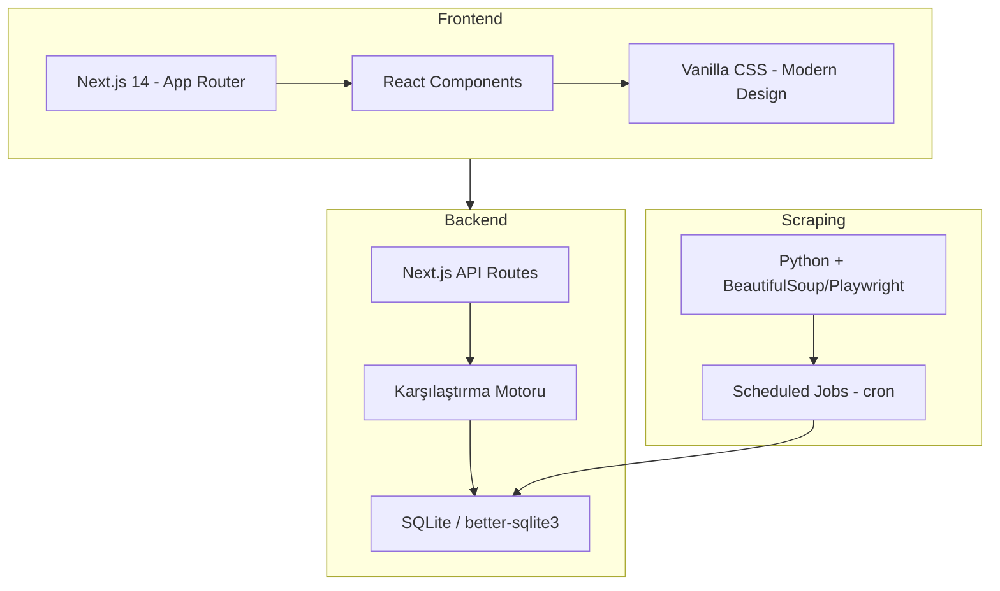
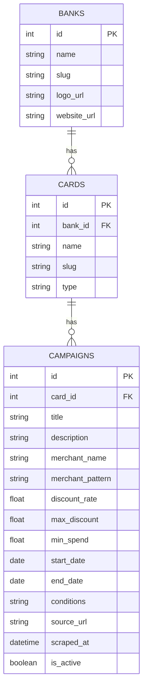
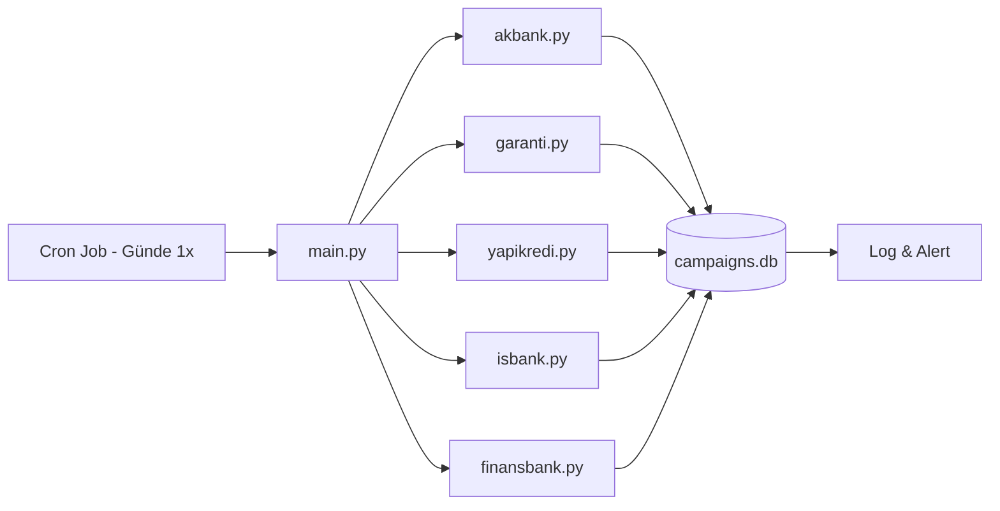
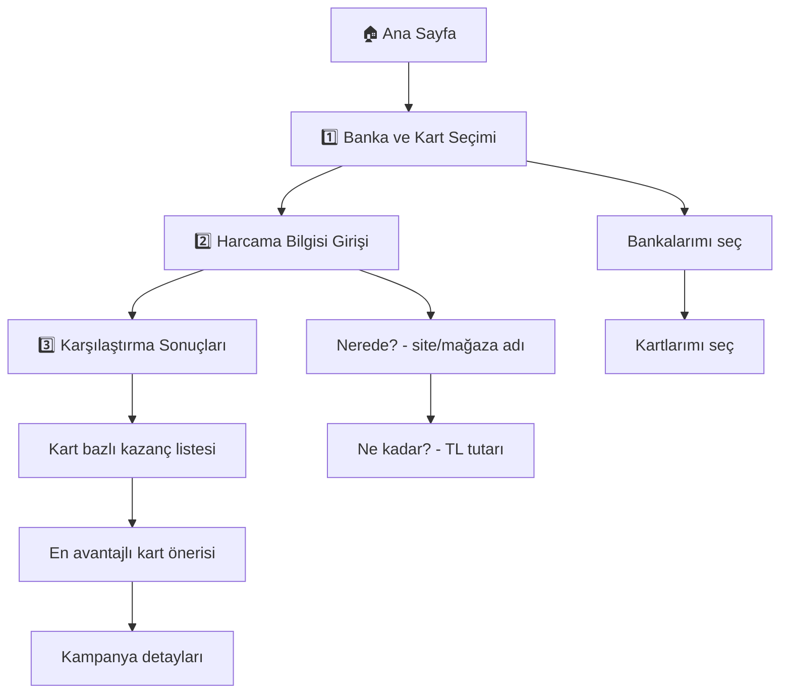
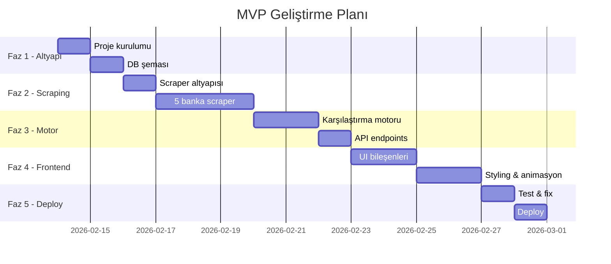

# 💳 Kredi Kartı Kampanya Karşılaştırma Uygulaması — Roadmap

Birden fazla bankanın kredi kartlarını kullanan kullanıcıların, bir harcama yapmadan önce hangi kartla en çok avantaj sağlayacağını görmelerini sağlayan bir web uygulaması.

---

## 📋 Proje Özeti

| Alan | Detay |
|------|-------|
| **Bankalar** | Akbank, Garanti BBVA, Yapı Kredi, İş Bankası, QNB Finansbank |
| **Kart Sayısı** | Banka başına 1-2 kart (~10 kart toplamda) |
| **Veri Kaynağı** | Banka sitelerinden otomatik scraping |
| **Auth** | Yok (MVP'de login gerekmez) |
| **Platform** | Web (responsive, mobil uyumlu) |
| **Yaklaşım** | MVP-first, iteratif geliştirme |

---

## 🏦 Bankalar ve Kartlar

| Banka | Kart 1 | Kart 2 |
|-------|--------|--------|
| **Akbank** | Axess | Wings |
| **Garanti BBVA** | Bonus | Shop&Fly |
| **Yapı Kredi** | World | Play |
| **İş Bankası** | Maximum | — |
| **QNB Finansbank** | CardFinans | — |

> [!NOTE]
> Kart listesi MVP sonrası kolayca genişletilebilir şekilde tasarlanacak.

---

## 🛠️ Teknoloji Stack



| Katman | Teknoloji | Neden |
|--------|-----------|-------|
| **Frontend** | Next.js 14 (App Router) | SSR, API routes, tek proje |
| **Styling** | Vanilla CSS | Tam kontrol, framework bağımsız |
| **Database** | SQLite (better-sqlite3) | Hafif MVP, kurulum gerektirmez |
| **Scraping** | Python + BeautifulSoup / Playwright | Scraping ekosistemi güçlü |
| **Scheduler** | Cron job (sistem seviyesi) | Basit, güvenilir |
| **Deployment** | Vercel (frontend) + VPS (scraper) | Ücretsiz tier mevcut |

---

## 🗺️ Fazlar

### Faz 1 — Proje Altyapısı (Tahmini: 1-2 gün)

#### 1.1 Proje Yapısı
```
/Users/melisyilmaz/berk/1/
├── frontend/               # Next.js uygulaması
│   ├── app/
│   │   ├── page.js         # Ana sayfa
│   │   ├── layout.js       # Root layout
│   │   ├── globals.css     # Design system
│   │   └── api/
│   │       ├── banks/route.js
│   │       ├── cards/route.js
│   │       └── compare/route.js
│   ├── components/
│   │   ├── BankSelector.js
│   │   ├── CardSelector.js
│   │   ├── SpendingForm.js
│   │   ├── ResultsPanel.js
│   │   └── CampaignCard.js
│   └── lib/
│       ├── db.js           # DB bağlantısı
│       └── engine.js       # Karşılaştırma motoru
├── scraper/                # Python scraper
│   ├── main.py
│   ├── banks/
│   │   ├── akbank.py
│   │   ├── garanti.py
│   │   ├── yapikredi.py
│   │   ├── isbank.py
│   │   └── finansbank.py
│   └── db.py               # DB yazma
├── data/
│   └── campaigns.db        # SQLite veritabanı
└── README.md
```

#### 1.2 Veritabanı Şeması



**Tablo açıklamaları:**

- **BANKS**: 5 banka bilgisi
- **CARDS**: Her bankanın kredi kartları (Axess, Bonus vb.)
- **CAMPAIGNS**: Kampanya detayları
  - `merchant_name`: Kampanyanın geçerli olduğu mağaza/site (örn: "Trendyol", "Migros")
  - `merchant_pattern`: Eşleştirme için pattern (örn: "trendyol", "trendyol.com")
  - `discount_rate`: İndirim oranı (% veya TL)
  - `max_discount`: Maksimum indirim tutarı
  - `min_spend`: Minimum harcama tutarı
  - `conditions`: Ek koşullar (taksit, vade vb.)

---

### Faz 2 — Kampanya Veri Toplama / Scraping (Tahmini: 3-4 gün)

Bu faz projenin en kritik ve en kırılgan kısmı.

#### 2.1 Scraper Mimarisi



#### 2.2 Her Banka İçin Scraper

Her scraper modülü şu adımları takip eder:
1. **Hedef URL belirleme** — Bankanın kampanya sayfası
2. **Sayfa render** — Playwright ile JS-rendered sayfalar için
3. **Veri çıkarma** — Kampanya başlığı, mağaza adı, indirim oranı, koşullar
4. **Normalizasyon** — Farklı formatları ortak şemaya dönüştürme
5. **DB'ye yazma** — Yeni kampanyalar ekle, süresi dolanları deaktive et

#### 2.3 Scraping Hedefleri

| Banka | Olası Kaynak URL'ler |
|-------|---------------------|
| Akbank | akbank.com/kampanyalar/kredi-karti |
| Garanti | garantibbva.com.tr/kampanyalar |
| Yapı Kredi | yapikredi.com.tr/kampanyalar |
| İş Bankası | isbank.com.tr/kampanyalar |
| Finansbank | qnbfinansbank.com/kampanyalar |

> [!WARNING]
> **Scraping Riskleri:**
> - Banka siteleri yapı değiştirebilir → Her scraper'a error handling ve alert mekanizması eklenecek
> - Rate limiting uygulanabilir → İstekler arası bekleme süresi konulacak
> - Bazı kampanyalar sadece mobil uygulamada olabilir → Bunlar başlangıçta kapsam dışı
> - ToS (Kullanım Koşulları) ihlali riski → Sadece public kampanya sayfaları taranacak

#### 2.4 Fallback: Manuel Veri Girişi

Scraping başarısız olursa veya doğrulama gerekirse:
- Basit bir admin script ile JSON/CSV'den kampanya verisi yüklenebilecek
- Bu MVP için yeterli bir fallback

---

### Faz 3 — Karşılaştırma Motoru (Tahmini: 2-3 gün)

#### 3.1 Kullanıcı Akışı



#### 3.2 Eşleştirme Algoritması

```
Kullanıcı girdisi: { yer: "Trendyol", tutar: 500 }

1. Kullanıcının seçtiği kartları al
2. Her kart için aktif kampanyaları sorgula
3. Her kampanya için:
   a. merchant_pattern ile kullanıcının girdiği yeri eşleştir (fuzzy match)
   b. min_spend kontrolü yap
   c. Kazancı hesapla: min(tutar × discount_rate, max_discount)
   d. Koşulları kontrol et
4. Sonuçları kazanç miktarına göre sırala
5. En avantajlı kartı öner
```

#### 3.3 Fuzzy Matching

Kullanıcı "trendyol" yazarsa, "Trendyol", "trendyol.com", "Trendyol Ekspres" gibi kampanyaları eşleştirmeli. Basit bir string similarity (Levenshtein distance veya includes-based) yeterli olacak MVP için.

---

### Faz 4 — Frontend UI (Tahmini: 3-4 gün)

#### 4.1 Sayfa Yapısı

**Tek sayfalık uygulama** — 3 adımlı wizard akışı:

| Adım | Bileşen | Açıklama |
|------|---------|----------|
| 1 | `BankSelector` + `CardSelector` | Kullanıcı bankalarını ve kartlarını seçer |
| 2 | `SpendingForm` | Nerede ve ne kadar harcayacağını girer |
| 3 | `ResultsPanel` + `CampaignCard` | Karşılaştırma sonuçları ve öneriler |

#### 4.2 Tasarım İlkeleri

- 🎨 **Modern & premium görünüm** — Glassmorphism, gradientler, subtle animasyonlar
- 📱 **Mobile-first responsive** — Tüm cihazlarda mükemmel deneyim
- ⚡ **Hızlı** — İstemci taraflı filtreleme, minimal API çağrısı
- 🏦 **Banka renkleri** — Her banka kendi renk paleti ile temsil edilecek (Akbank: turuncu, Garanti: yeşil vb.)

#### 4.3 UI Akış Detayı

**Adım 1 — Kart Seçimi:**
- Banka logoları grid'de gösterilir
- Tıklanan bankanın kartları açılır
- Multi-select: birden fazla banka ve kart seçilebilir
- Seçilen kartlar üst kısımda chip olarak gösterilir

**Adım 2 — Harcama Girişi:**
- Basit bir form: "Nerede?" (text input with autocomplete) + "Ne kadar?" (number input)
- Autocomplete: Daha önce kampanyası olan mağaza/siteleri önerir
- "Karşılaştır" butonu

**Adım 3 — Sonuçlar:**
- Kart bazlı sıralı liste (en avantajlı üstte)
- Her kart için: kazanç tutarı, uygulanabilir kampanyalar, koşullar
- Kazanç yoksa "Bu harcama için aktif kampanya bulunamadı" mesajı
- Kampanya detayına tıklayınca banka sitesine yönlendirir

---

### Faz 5 — Polish, Test & Deploy (Tahmini: 2-3 gün)

#### 5.1 Test Stratejisi

| Test Türü | Kapsam |
|-----------|--------|
| Unit test | Karşılaştırma motoru, fuzzy matching |
| Integration test | API endpoint'leri |
| Browser test | Kullanıcı akışı (seçim → giriş → sonuç) |
| Scraper test | Her banka scraper'ı için mock data |

#### 5.2 Deployment

- **Frontend**: Vercel (Next.js native desteği, ücretsiz tier)
- **Scraper**: Herhangi bir VPS veya GitHub Actions (scheduled workflow)
- **Database**: SQLite dosyası (küçük veri, ilişkisel DB yeterli)

#### 5.3 SEO

- Anlamlı sayfa başlığı ve meta description
- Semantik HTML yapısı
- Open Graph meta tag'leri

---

## 📅 MVP Timeline



**Toplam tahmini süre: ~15 gün (2-3 hafta)**

---

## 🔮 MVP Sonrası Potansiyel Özellikler

- 🔐 Kullanıcı girişi ve kart kaydetme
- 📊 Harcama geçmişi ve kazanç takibi
- 🔔 Yeni kampanya bildirimleri
- 📱 Native mobil uygulama
- 🏪 Daha fazla banka ve kart desteği
- 🤖 AI-powered kampanya önerileri
- 📧 Haftalık kampanya özeti e-postası

---

## Verification Plan

### Automated Tests
- **Karşılaştırma Motoru Unit Tests**: `npm test` ile çalıştırılacak Jest testleri
- **API Integration Tests**: `npm run test:api` ile API endpoint testleri
- **Scraper Tests**: `python -m pytest scraper/tests/` ile mock data üzerinden test

### Browser Testing
- Tarayıcı aracıyla tüm kullanıcı akışı test edilecek:
  1. Ana sayfayı aç → banka ve kart seç
  2. Harcama bilgisi gir
  3. Sonuçların doğru gösterildiğini doğrula

### Manual Verification
- Scraper'ların gerçek banka sitelerinden doğru veri çektiğini elle kontrol et
- Farklı ekran boyutlarında responsive tasarımı kontrol et
